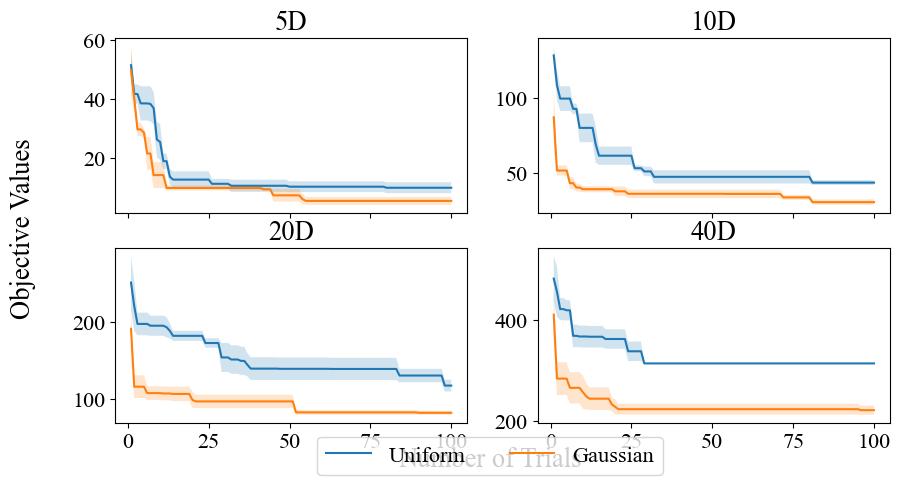
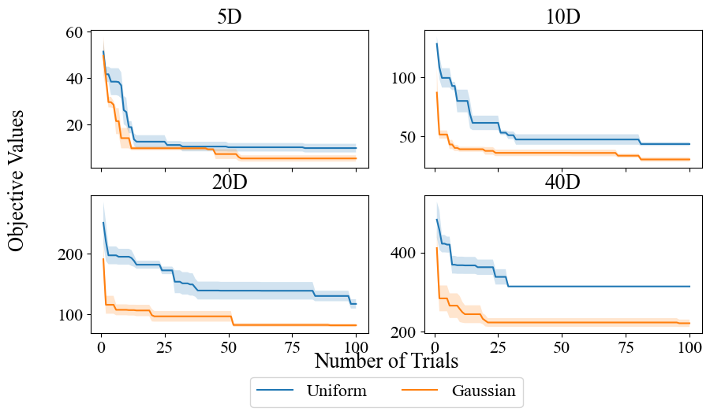

# Configure Matplotlib with Optuna MCP

This example aims to show the combination of qualitative evaluation by an LLM agent and the black-box optimization by Optuna MCP.
As a simple example, we use Matplotlib.

## Overview

Simply put, an LLM agent qualitatively evaluates the legend position of images generated by `target_generator` in the self-implemented Matplotlib MCP ([matplotlib_server.py](./matplotlib_server.py)) based on the instruction detailed later and searches for the optimal legend position using Optuna based on the qualitative judge.
To keep the example simple, we consider only one parameter.

> [!NOTE]
> There is room for improvement in the qualitative evaluation scheme and the optimization itself, but such enhancement is not the scope of this example. 

<table>
    <caption>Default and optimized figures. <b>Left</b>: The default figure. The legend overlaps with the x-label, making it hard to recognize the label. <b>Right</b>: The optimized figure. The overlap is successfully removed by the optimization using Optuna, making the x-label visible.</caption>
    <tr>
        <td></td>
        <td></td>
    </tr>
</table>

## Workflow

The example works as follows:
1. Suggest the position controlling parameter, i.e., `bbox_to_anchor_y`, using Optuna MCP.
2. Generate an image file using Matplotlib MCP.
3. Upload the image file manually and let the LLM agent qualitatively evaluate the image file based on the instruction described in `Prompt`.
4. Report the qualitative score using Optuna MCP.
5. Repeat 1. -- 4.

## How to Reproduce Demo

### Setups

Please first install the dependencies for this example:

```shell
$ pip install matplotlib numpy "mcp[cli]>=1.5.0"
```

The directory structure of this example should look like:

```shell
$ tree ./auto-matplotlib
auto-matplotlib/
└── matplotlib_server.py
```

To enable the MCP server for Matplotlib in Claude Desktop, go to `Claude > Settings > Developer > Edit Config > claude_desktop_config.json` and add the following inside `mcpServers`:


```json
"AutoMatplotlib": {
    "command": "/path/to/uv",
    "args": [
        "--directory",
        "/path/to/auto-matplotlib",
        "run",
        "matplotlib_server.py"
    ]
}
```

### Prompt

Use the following prompt to iterate the routine described in `Workflow`:

```txt
Create a study named `auto-matplotlib-demo` to maximize the qualitative score of plot figures.

Our task is to optimize the legend position in the figure.
The legend MUST be located below the `xlabel`.
We will optimize the position by controlling `bbox_to_anchor_y` in range of `(-0.1, 0.1)`.

After that, repeat the following five times:
1. Sample a trial from Optuna MCP.
2. Generate a plot given the trial using `target_generator`.
3. Ask me to upload the generated image.
4. Look at the generated image and evaluate `bbox_to_anchor_y` qualitatively from 1 (worst) to 9 (best).
5. Tell the qualitative assessment to Optuna MCP.

Note that `bbox_to_anchor_y` is not good if:
- the legend hides the `xlabel` of the figure,
- the legend hides the main plots or is located above `xlabel`,
- there is an insufficient margin between the upper part of the legend and the lower part of the `xlabel`.

Please evaluate each criterion qualitatively from 1 (worst) to 3 (best).
```
