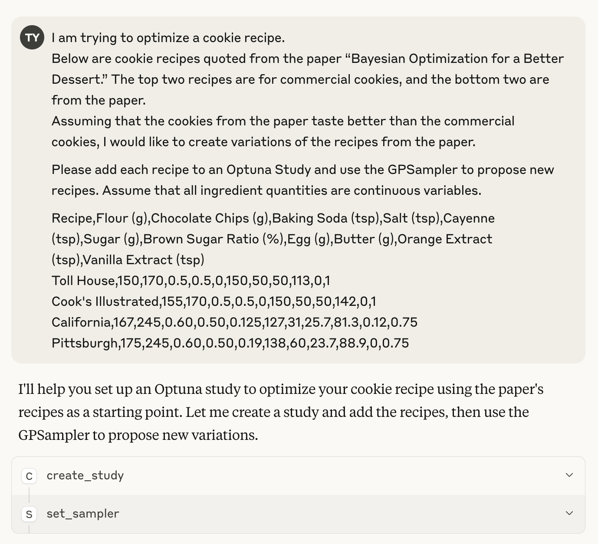
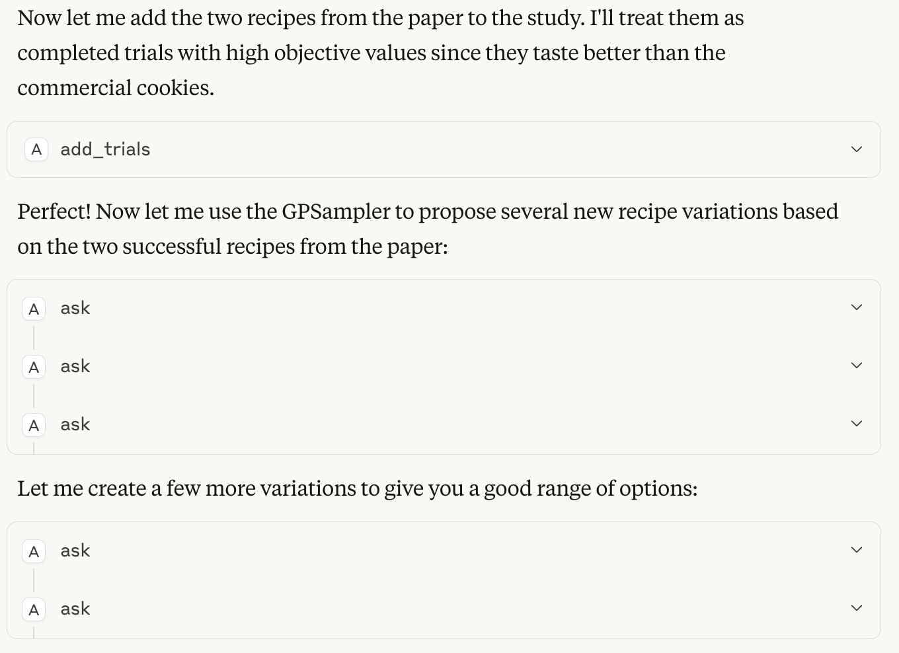
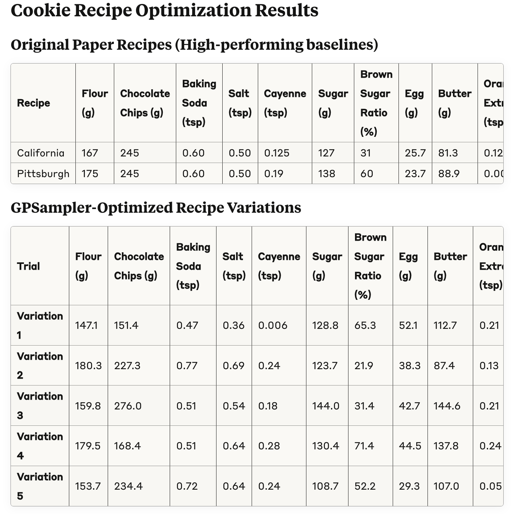

## Optimizing the Cookie Recipe

In this example, we will optimize a cookie recipe, referencing the paper titled "[Bayesian Optimization for a Better Dessert](https://research.google/pubs/bayesian-optimization-for-a-better-dessert/)".

In the paper, the Bayesian optimization algorithm proposes recipes, professional chefs bake cookies according to those recipes, and people rate the results. This process is repeated to optimize the recipe.

The recipes introduced in this paper are as follows.
The top two are store-bought cookies, and the bottom two are recipes obtained through the optimization experiment.

Using these recipes, let's propose an improved recipe using Optuna.


| Recipe             | Flour (g) | Chocolate Chips (g) | Baking Soda (tsp) | Salt (tsp) | Cayenne (tsp) | Sugar (g) | Brown Sugar Ratio (%) | Egg (g) | Butter (g) | Orange Extract (tsp) | Vanilla Extract (tsp) |
|--------------------|-----------|---------------------|-------------------|------------|---------------|-----------|----------------------|---------|------------|----------------------|-----------------------|
| Toll House         | 150       | 170                 | 0.5               | 0.5        | 0             | 150       | 50                   | 50      | 113        | 0                    | 1                     |
| Cook's Illustrated | 155       | 170                 | 0.5               | 0.5        | 0             | 150       | 50                   | 50      | 142        | 0                    | 1                     |
| California         | 167       | 245                 | 0.60              | 0.50       | 0.125         | 127       | 31                   | 25.7    | 81.3       | 0.12                 | 0.75                  |
| Pittsburgh         | 175       | 245                 | 0.60              | 0.50       | 0.19          | 138       | 60                   | 23.7    | 88.9       | 0                    | 0.75                  |

### How to Run Optimization Using Optuna MCP Server

The prompt to be entered into the MCP client is as follows:

```
I am trying to optimize a cookie recipe.
Below are cookie recipes quoted from the paper “Bayesian Optimization for a Better Dessert.” The top two recipes are for commercial cookies, and the bottom two are from the paper.
Assuming that the cookies from the paper taste better than the commercial cookies, I would like to create variations of the recipes from the paper.

Please add all recipes to an Optuna Study and use the GPSampler to propose new recipes. Assume that all ingredient quantities are continuous variables.

Recipe,Flour (g),Chocolate Chips (g),Baking Soda (tsp),Salt (tsp),Cayenne (tsp),Sugar (g),Brown Sugar Ratio (%),Egg (g),Butter (g),Orange Extract (tsp),Vanilla Extract (tsp)
Toll House,150,170,0.5,0.5,0,150,50,50,113,0,1
Cook's Illustrated,155,170,0.5,0.5,0,150,50,50,142,0,1
California,167,245,0.60,0.50,0.125,127,31,25.7,81.3,0.12,0.75
Pittsburgh,175,245,0.60,0.50,0.19,138,60,23.7,88.9,0,0.75
```

In this prompt, we first register the recipes in the paper written in CSV format as an Optuna Study.
Since the exact score is unknown, we let the LLM adjust the score so that the optimized cookie is judged to be tastier than the off-the-shelf product.

Next, we propose a new recipe using the Gaussian Process-based Bayesian optimization Sampler.

### Results

The results may vary depending on the client, but for example, they may look like the following:

First, a Study is created (`create_study`), and the GPSampler is configured (`set_sampler`).



Next, the CSV-formatted recipe is registered to the Study (`add_trials`), and a new recipe proposal is made (`ask`).



Some MCP clients also present new recipes in tabular format.



### Summary

In this example, we handled a cookie recipe, but this method can be applied to various fields.
For example, it could suggest the next values to try in biological, chemical, or materials experiments where experimental conditions and results are managed in a spreadsheet.

Please try this in your use case.
